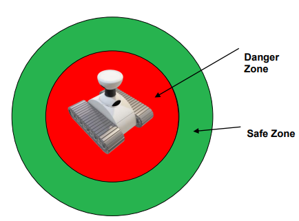
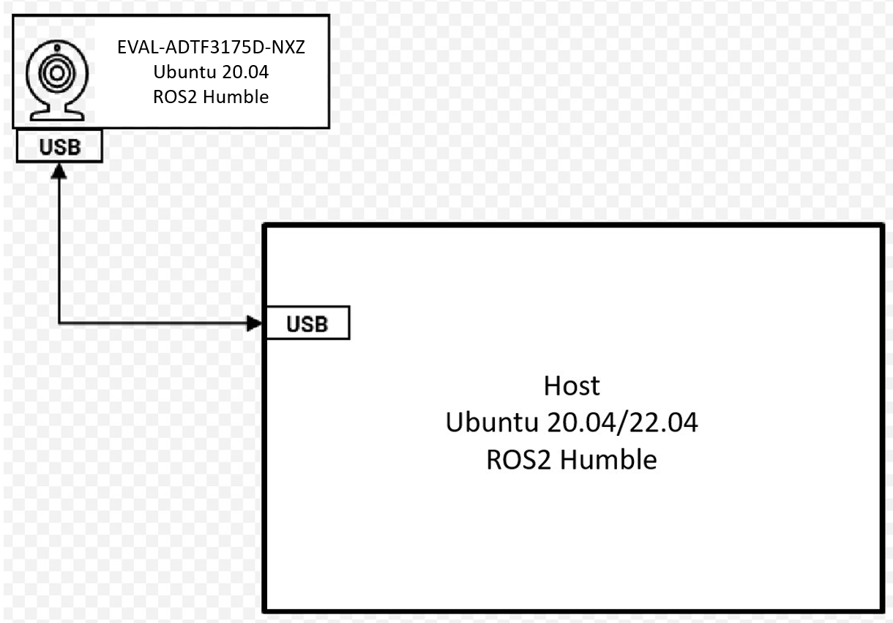
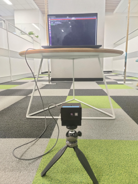
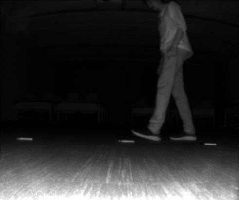
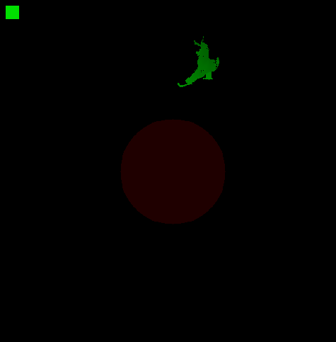
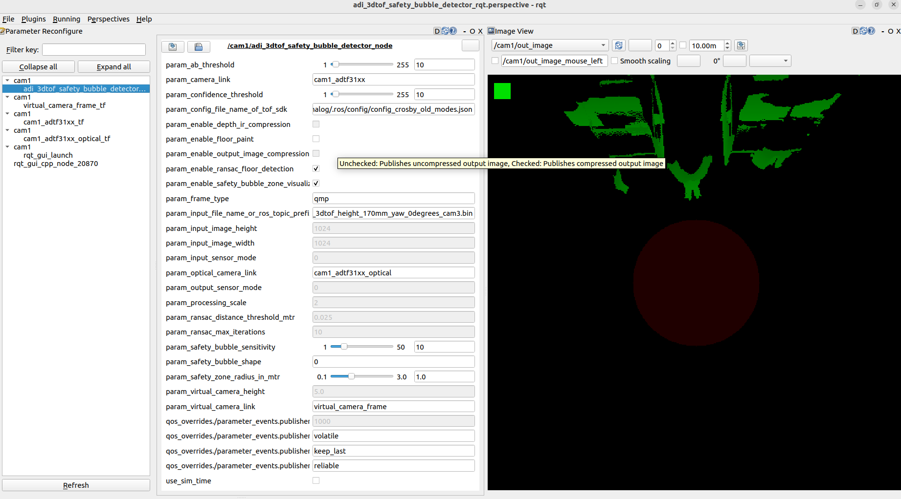

# Analog Devices 3DToF Safety Bubble Detector

## Overview
The **ADI 3DToF Safety Bubble Detector** is a ROS(Robot Operating System) package for the Safety Bubble Detection application. The Safety Bubble Detectors are the basic building block of any AGV/AMR. 
The safety zone is a virtual area around an AGV/AMR. The Safety Bubble Detectors are used to detect the 
presence of any object inside this zone and prevent the AGV/AMR from colliding on to the object.

The **ADI 3DToF Safety Bubble Detector** is developed as a ROS application running on the ADI’s *EVAL-ADTF3175D-NXZ* Time-of-Flight platform. The Safety Bubble Detection algorithm is highly optimized 
to run at 30FPS on the *EVAL-ADTF3175D-NXZ* platform.
The node uses [*ADI ToF SDK*](https://github.com/analogdevicesinc/ToF/) APIs to capture the frames from the sensor. The algorithm is run on the captured images and the output is published as ROS topics.
The Node publishes the detection flag and the output visualization image as the topics. The Depth and IR images are also published as ROS topics. The topics are published at 30FPS.

<div style="text-align:center"></div>



[](https://docs.ros.org/en/humble/index.html) [](https://releases.ubuntu.com/focal/) [](https://releases.ubuntu.com/jammy/) [](LICENSE)   

## Hardware

- [EVAL-ADTF3175D-NXZ Module](https://www.analog.com/en/design-center/evaluation-hardware-and-software/evaluation-boards-kits/EVAL-ADTF3175.html#eb-overview)
- USB Type-C to Type-A cable - with 5gbps data speed support
- Host laptop with intel i5 or higher cpu running Ubuntu-20.04LTS or Ubuntu-22.04LTS

 :memo: _Note_: Refer the [EVAL-ADTF3175D-NXZ User Guide](https://wiki.analog.com/resources/eval/user-guides/eval-adtf3175d-nxz) to ensure the Eval module has adequate power supply during operation.

The image below shows the connection diagram of the setup:

<div style="text-align:center"></div>
  
  
> :memo:
> **ADSD3500 Firmware :**  
> Make sure the sensor is flashed with the compatible FW. The minimum version is listed below:   
> **AM series : 5.2.5.0**  
> Follow the below instructions to read the FW version  
>  1. Login to the EVAL-ADTF3175D-NXZ module using ssh. On the Host machine open the “Terminal” and run the following command to ssh to the device.  
>     ```bash
>     $ ssh analog@10.43.0.1
>          Username: analog   
>          Password: analog     
>     ```  
>  2. Run the follwing commands
>     ```bash 
>     $ cd ~/Workspace/Tools/ctrl_app
>     $ ./ctrl_app
>     ```
> The output would look like below,  
>   **V4L2 custom control interface app version: 1.0.1**  
>   **59 31**   
>   **<span style="color:red">**05 02 05 00**</span> 61 35 39 61 66 61 64 36 64 36 63   38 65 37 66 62 31 35 33 61 32 64 62 38 63 64 38 38 34 30 33 35 39 66 31 37 31 39 35 61**   
>   **59 31**   
> The first four bytes in the third line represents the FW version. For example for the output above, the version is **5.2.5.0**  
> If the firware version is older than this please upgrade the FW using the following instructions
>  1. Install ADI ToF SDK release [v6.0.1](https://github.com/analogdevicesinc/ToF/releases/tag/v6.0.1)  
>  2. After installing goto the inastallation folder and run the following commands to download the image   
>      ```bash
>      $ cd ~/Analog\ Devices/ToF_Evaluation_Ubuntu_ADTF3175D-Relx.x.x/image.
>      $ chmod +x get_image.sh and ./get_image.sh.
>      ```
>       - Latest image will be downloaded at ./image path as NXP-Img-Relx.x.x-ADTF3175D-.zip. Extract this folder using unzip NXP-Img-Relx.x.x-ADTF3175D-.zip command.
>       - This folder contains the NXP image and ADSD3500 firmware(Fw_Update_x.x.x.bin).  
> 3. Run the following command to copy the Fimware to the NXP device
>    ```bash
>     $ scp Fw_Update_5.2.5.bin analog@10.43.0.1:/home/analog/Workspace
>          Username: analog 
>          Password: analog
>    ```    
> 4. Now login to the device and run the Firmware upgrade command.  
> **:warning: <span style="color:red"> Do not interrupt/abort while the upgrade is in progress.Doing this may corrupt the module.**</span>  
>    ```bash
>    $ ssh analog@10.43.0.1 
>        Username: analog 
>        Password: analog   
>    $ cd Workspace/ToF/build/examples/data_collect/
>    $ ./data_collect --fw ~/Workspace/Fw_Update_x.x.x.bin config/config_default.json
>    ```  
> 5. Reboot the board after the successful operation.  
           
For details refer to [EVAL-ADTF3175D-NXZ NVM upgrade guide](https://wiki.analog.com/resources/eval/user-guides/eval-adtf3175d-nxz-upgrade-firmware)

## Software

Pre-requisites for using this package:
* Linux System or WSL2(Only FileIO mode works.) running Ubuntu 20.04LTS or Ubuntu 22.04LTS
* Install WSL2 using these [steps](https://ubuntu.com/tutorials/install-ubuntu-on-wsl2-on-windows-10#7-enjoy-ubuntu-on-wsl) 
* ROS2 Humble: If not installed, follow these [steps](https://docs.ros.org/en/humble/Installation/Ubuntu-Install-Debians.html).
* Setup ros2 workspace (with workspace folder named as "ros2_ws"). If not done, follow these [steps](https://docs.ros.org/en/humble/Tutorials/Beginner-Client-Libraries/Creating-A-Workspace/Creating-A-Workspace.html).

1. Download and install the latest version of *ADI 3DToF Safety Bubble Detector* from the Release pages.

2. After installing the software, go to the installation folder(~/Analog Devices/ADI3DToFSafetyBubbleDetector-Relx.x.x) and run the get_image.sh script. This script will download the custom Ubuntu 20.04 image for the EVAL-ADTF3175D-NXZ. 

3.	Flash .img file to the SD card, follow steps in this link [EVAL-ADTF3175D-NXZ Users Guide](https://wiki.analog.com/resources/eval/user-guides/eval-adsd3100-nxz/flashing_image_instructions) to flash the .img file to SD card.
    
    *Note*: This image contains the necessary software and code to start using the ROS node. The source code for the ```adi_3dtof_safety_bubble_detector``` can be found in ```/home/analog/ros2_ws/src/```

4.	Follow the instructions below to run the *adi_3dtof_safety_bubble_detector* application on the EVAL-ADTF3175D-NXZ module.

5.	Connect the EVAL-ADTF3175D-NXZ module to the PC using the USB3.0 cable and wait for the network to come up. By default, the device ip is set to **10.43.0.1**. Refer to [EVAL-ADTF3175D-NXZ Startup Guide](https://wiki.analog.com/eval-adtf3175d-nxz-startup#software_download) for details.

6.	Login to the EVAL-ADTF3175D-NXZ module using ssh. On the Host machine open the “Terminal” and run the following command to ssh to the device.
    ```bash
    $ ssh analog@10.43.0.1 
      Username: analog 
      Password: analog   
    ```

    *Note*: If you do not have a Linux Host machine, then install Windows Subsystem for Linux(WSL) and Ubuntu 22.04 on Windows. 
    Refer to this [link](https://learn.microsoft.com/en-us/windows/wsl/install) for instructions.


> :memo:  
> 1. **Setting Date/Time:**  
> Make sure the Date/Time is set properly before compiling and running the application. Connecting to a WiFi network would make sure the Date/Time is set properly. The custom Ubuntu 20.04 image is configured to connect to a network with following SSID and Password by default.  
>    ```  
>    SSID : ADI,  
>    Password: analog123  
>    ```  
>    You can either setup a network with the above properties or configure the Device to connect to any available network.  
>    Alternatively, the Host machine can be setup as a local NTP server and the devices can be configured to update Date/Time using the Host machine.  
>    Refer to below links for setting and configuring NTP on Ubuntu machines.
>    - https://askubuntu.com/questions/14558/how-do-i-setup-a-local-ntp-server
>    - https://vitux.com/how-to-install-ntp-server-and-client-on-ubuntu/
> 2. **Building the package**  
>    The ROS Humble and dependent packages are already installed in the EVAL-ADTF3175D-NXZ image and the source code for the *adi_3dtof_safety_bubble_detector* is present in `/home/analog/ros2_ws/src/` folder. The package is also pre-built, hence there is no need to build the package.  
>    If the source files are modified, then use the following commands to build the package.
>    ```bash
>    $ source /opt/ros/humble/install/setup.bash
>    $ cd ~/ros2_ws/  
>    $ colcon build --symlink-install --cmake-args -DCMAKE_BUILD_TYPE=Release -DNXP=1 --parallel-workers 1
>    $ source install/setup.bash 
>    ```
>    > Note: `/home/analog/ros2_ws/` is set up as the ros2 workspace.
>    > **:warning: <span style="color:red">If the above command is stuck in the console then execute below commands**</span> 
>    > ```bash
>    > $ cd ~/ros2_ws/build/adi_3dtof_safety_bubble_detector 
>    > $ make -j1
>    > ```
> 3. Once the build is successful, run the below commands so that symlinks gets installed in the proper paths.
>    ```bash
>    $ cd ~/ros2_ws/
>    $ colcon build --symlink-install --cmake-args -DCMAKE_BUILD_TYPE=Release
>    $ source install/setup.bash
>    ```

7.	Running the ROS Node:  
    On the Device:
    ```bash
    $ ros2 launch adi_3dtof_safety_bubble_detector adi_3dtof_safety_bubble_detector_single_camera_launch.py
    ```
    At this stage, the *adi_3dtof_safety_bubble_detector* will be launched and start publishing the topics ```/cam1/depth_image, /cam1/ab_image, /cam1/out_image, /cam1/obect_detected and /cam1/camera_info```.  
    To see the depth and IR images on the Host machine, simply open the RViz by typing command ```$rviz2``` and add ```/cam1/depth_image```, ```/cam1/ab_image``` and ```/cam1/out_image``` topics to visualize the images

8.  **Publishing compressed output image:**  
    This feature enables multiple sensors to run in 30FPS.  
    change the below parameter in ```adi_3dtof_safety_bubble_detector_single_camera_launch.py``` file.
    
    `arg_enable_output_image_compression` set it to "true"

    On the Device:
    ```bash
    $ ros2 launch adi_3dtof_safety_bubble_detector adi_3dtof_safety_bubble_detector_single_camera_launch.py
    ```

    On host:
    ```bash
    $ ros2 launch adi_3dtof_safety_bubble_detector adi_3dtof_safety_bubble_detector_host_multiple_cameras_launch.py
    ```

    *Note:* The file ```adi_3dtof_safety_bubble_detector_host_multiple_cameras_launch.py``` subscribes to the output images and combines them to give the top view. All of the camera prefixes (such as cam1, cam2) that the program wants to combine to create a top view should be in the ```arg_camera_prefixes``` argument.

### Output Images

Sample output images are shown below:  
```/cam1/depth_image```  


```/cam1/ab_image```  



```/cam1/out_image```  


> :memo: *Note*  
> To setup Safety Bubble Detector with 4 devices refer [Setting up 4 device for Safety Bubble Detector](docs/4DevicesSetup.md)

## Nodes
### adi_3dtof_safety_bubble_detector_node
#### Published topics

These are the default topic names, topic names can be modified as a ROS parameter.
| **Topic Name**                     | **Description**                                                                                     |
|------------------------------------|-----------------------------------------------------------------------------------------------------|
| **/depth_image**                   | 16-bit Depth image of size 512x512                                                                  |
| **/ab_image**                      | 16-bit IR image of size 512x512                                                                     |
| **/out_image**                     | 8-bit output image of size 512x512                                                                  |
| **/object_detected**               | Boolean to indicate the object detection                                                            |
| **/camera_info**                   | Camera info                                                                                         |
| **/depth_image/compressedDepth**   | 512x512 16-bit Depth image from `adi_3dtof_safety_bubble_detector` node compressed with RVL compression (if enabled) |
| **/ab_image/compressedDepth**      | 512x512 16-bit IR image from `adi_3dtof_safety_bubble_detector` node compressed with RVL compression (if enabled) |
| **/out_image/compressed**          | 512x512 8-bit output image from `adi_3dtof_safety_bubble_detector` node compressed with JPEG compression (if enabled) |

### Parameters

| **Parameter Name**                              | **Type**   | **Default Value**                     | **Description**                                                                                     |
|-------------------------------------------------|------------|---------------------------------------|-----------------------------------------------------------------------------------------------------|
| **var_cam1_base_frame**                           | String     | "adi_camera_link"                    | Name of camera Link                                                                                 |
| **var_cam1_base_frame_optical**                   | String     | "optical_camera_link"                | Name of optical camera Link                                                                         |
| **var_virtual_camera_base_frame**                   | String     | "virtual_camera_link"                | Name of virtual camera Link                                                                         |
| **arg_safety_bubble_radius_in_mtr**             | float      | 1.0f                                 | Safety zone radius                                                                                  |
| **arg_safety_bubble_shape**                   | int        | 0                                    | Safety bubble shape, _0: circular, 1: Square_                                                       |
| **arg_virtual_camera_height_z_in_mtr**                 | float      | 5.0f                                 | Virtual camera height, default value is 5 meters.                                                   |
| **arg_input_sensor_mode**                     | int        | 0                                    | Input mode, _0: Real Time Sensor, 2: Rosbag bin, 3: Network Mode_                                   |
| **arg_output_mode**                    | int        | 0                                    | Output mode, _0: No output files written, 1: avi and csv output files are written_                  |
| **arg_input_file_name_or_ros_topic_prefix_name** | String     | "no name"                            | Input filename: Applicable only if the input mode is 2. Represents input file name or topic prefix. |
| **arg_enable_ransac_floor_detection**         | int        | true                                 | Enable option for RANSAC floor detection, _0: disable, 1: enable_                                   |
| **arg_enable_depth_ab_compression**           | int        | false                                | Enable option to publish depth and IR compressed images, _0: disable, 1: enable_                   |
| **arg_enable_output_image_compression**       | int        | false                                | Enable option to publish compressed output image, _0: disable, 1: enable_                          |
| **arg_safety_bubble_detection_sensitivity**             | int        | 10                                   | Number of connected pixels to trigger object detection                                              |
| **arg_enable_floor_paint**                    | int        | false                                | Enable option to visualize floor paint, _0: disable, 1: enable_                                     |
| **arg_enable_safety_bubble_zone_visualization** | int        | false                                | Enable option to visualize safety bubble zone, _0: disable, 1: enable_                              |                                                |
| **arg_ransac_distance_threshold_mtr**         | float      | 0.025f                               | The height of the floor RANSAC can find, default value is 2.5 cm                                    |
| **arg_ransac_max_iterations**                 | int        | 10                                   | Maximum iterations RANSAC is allowed                                                               |
| **arg_ab_threshold**                          | int        | 10                                   | abThreshold for the sensor                                                                          |
| **arg_confidence_threshold**                  | int        | 10                                   | Confidence threshold for the sensor. Default value varies based on sensor serial number.            |                                                     |
| **arg_config_file_name_of_tof_sdk**           | String     | "config/config_adsd3500_adsd3100.json" | Configuration file name of ToF SDK. Varies based on Eval Board series.                             |
| **arg_camera_mode**                            | int     | 3                                | Frame Type. Varies based on Eval Board series.                                                      |


### adi_3dtof_safety_bubble_detector_stitch_host_node

#### Published topics

| **Topic Name**                     | **Description**                                                                                     |
|------------------------------------|-----------------------------------------------------------------------------------------------------|
| **/combo_safety_bubble_out_image** | 8-bit output image of size 512x512                                                                  |
| **/combo_safety_bubble_object_detected** | Boolean topic indicates object detection                                                            |  

#### Subscribed topics

| **Topic Name**               | **Description**                                                                 |
|------------------------------|---------------------------------------------------------------------------------|
| **/object_detected**         | Boolean topic indicates object detection                                        |
| **/out_image/compressed**    | Subscribes to compressed output image from `adi_3dtof_safety_bubble_detector` node |
| **/out_image**               | Subscribes to output image from `adi_3dtof_safety_bubble_detector` node         |

#### Parameters

+ **param_camera_prefixes** (String, default: "no name")
    - ROS Topic prefix name to subscribe

> :memo: _Notes:_ 
> - _If any of these parameters are not set/declared, default values will be used._
> - _Enabling file input may slow down the speed of publishing._

## Dynamic Reconfigure
Using Dynamic Reconfigure some parameters of *adi_3dtof_safety_bubble_detector* ROS node can be modifed during run time. The Perspective file is present in ```rqt_config/``` folder.  

<div style="text-align:center"></div>  
The GUI can be started by running the following command.

``` ros2 launch adi_3dtof_safety_bubble_detector adi_3dtof_safety_bubble_detector_rqt_launch.py ```  

Make sure the *adi_3dtof_safety_bubble_detector* is already running before executing this command.

## Limitations

None

## Support

Please contact the `Maintainers` if you want to evaluate the algorithm for your own setup/configuration.
Any other inquiries are also welcome.

# Appendix 1:
## Steps to run the Node on a Host machine in File-IO mode
The Node can be run on a Host machine without the need for the actual 3DToF sensor. This mode is supported for users who would want to test algorithm and to tune algorithm parameters on the recorded video files. In this mode the *adi_3dtof_safety_bubble_detector_node* will read the video file and publish the frames as ROS topics. Follow the below instructions to build and run the node in File-IO mode.

*Note:* It is assumed that the correct version of ROS is installed and configured properly, if not please install the ROS from [here](https://docs.ros.org/en/humble/Installation/Ubuntu-Install-Debians.html) 

### Requirement on file-io input video files
To run the *adi_3dtof_safety_bubble_detector_node* in file-io mode, the video files should be given as input.
Please follow the below instructions to set up the input video files.
1. After installing the software, go to the installation folder (~/Analog Devices/ADI3DToFSafetyBubbleDetector-Relx.x.x)
2. Run the *get_videos.sh* script which will download the *adi_3dtof_input_video_files.zip* file in the current directory.
3. Unzip it and copy the directory as *~/ros2_ws/src/adi_3dtof_input_video_files*.
4. Update the input file argument *arg_input_file_name_or_ros_topic_prefix_name* in the launch file *adi_3dtof_safety_bubble_detector_single_camera_launch.py* as per the above file path.
5. If you want to debug the algorithm based on the bag file you captured, convert the bag file to the bin format (which our ROS package supports) using [adi_3dtof_adtf31xx](https://github.com/analogdevicesinc/adi_3dtof_adtf31xx.git). Please go through the steps to use the adi_3dtof_adtf31xx_read_rosbag_node

### Steps to run *adi_3dtof_safety_bubble_detector_node* node

1. Clone the repo and checkout the corect release branch/
tag into ros workspace directory

    ```bash
    $ cd ~/ros2_ws/src
    $ git clone https://github.com/analogdevicesinc/adi_3dtof_safety_bubble_detector.git -b v2.1.0
    ```
2. clone aditof SDK
    ```bash
    $ cd ~/ros2_ws/src
    $ git clone https://github.com/analogdevicesinc/libaditof.git -b v6.0.1
    ```
3. Update submodules in aditof SDK
    ```bash
    $ cd ~/ros2_ws/src/libaditof
    $ git submodule update --init --recursive
    ```
4. Install dependencies:
    ```bash
    $ cd ~/ros2_ws/
    $ rosdep install --from-paths src -y --ignore-src    
    ```
5. Build the package
    ```bash
    $ cd ~/ros2_ws
    $ colcon build --symlink-install --cmake-args -DCMAKE_BUILD_TYPE=Release -DSENSOR_CONNECTED=TRUE -DBUILD_SBD_STITCH_HOST_NODE=TRUE
    $ source install/setup.bash
    ```
6. Link run time libraries
    ```bash
    $ echo "export LD_LIBRARY_PATH=~/catkin_ws/install/lib:\$LD_LIBRARY_PATH" >> ~/.bashrc
    $ source ~/.bashrc
    ```
7. To run the `adi_3dtof_safety_bubble_detector_node` in File-IO mode, we need to make some changes in the launch file. Change the following parameters in launch file.

    `arg_input_sensor_mode` to be set to *2*  
    `arg_input_file_name_or_ros_topic_prefix_name` to be set to the input file name

8. After updating the launch file, run the ros2 launch with the updated launch file.
    ```bash
    $ ros2 launch adi_3dtof_safety_bubble_detector adi_3dtof_safety_bubble_detector_single_camera_launch.py
    ```
## Build Flags

The following build flags can be used to configure the package during the build process:

| **Flag**                  | **Type** | **Default Value** | **Description**                                                                 |
|--------------------------------|----------|-------------------|---------------------------------------------------------------------------------|
| **SENSOR_CONNECTED**           | Boolean  | TRUE              | Set to `TRUE` if a sensor is connected, otherwise set to `FALSE` for File-IO mode. |
| **BUILD_SBD_STITCH_HOST_NODE** | Boolean  | FALSE              | Set to `TRUE` to build the `adi_3dtof_safety_bubble_detector_stitch_host_node`. |


At this stage, the `adi_3dtof_safety_bubble_detector_node` will be launched and start publishing the topics ```/cam1/depth_image, /cam1/ab_image, /cam1/out_image, /cam1/camera_info and /cam1/object_detected```.  
To see the depth and IR images open an other Terminal and open the RVIZ and add ```/cam1/depth_image```, ```/cam1/ab_image``` and ```/cam1/out_image``` topics to visualize the images.  
For details on the parameters please refer to the launch files present in the ```launch/``` folder.
<br>  
<br>

