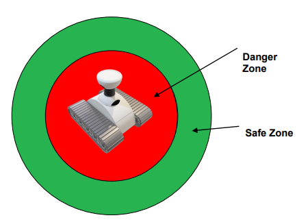
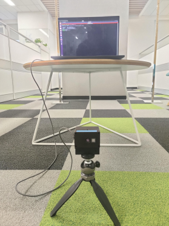
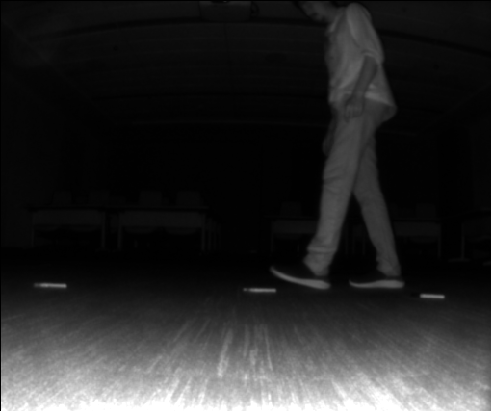
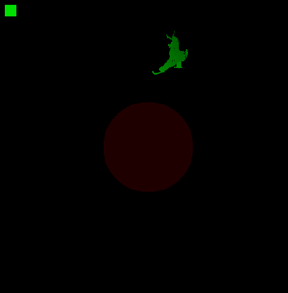
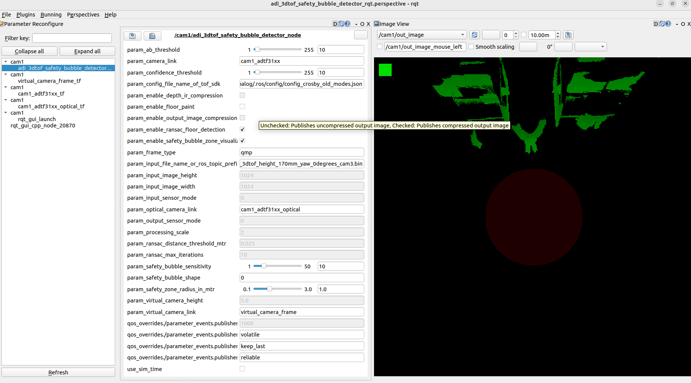

# Analog Devices 3DToF Safety Bubble Detector

## Overview
The **ADI 3DToF Safety Bubble Detector** is a ROS(Robot Operating System) package for the Safety Bubble Detection application. The Safety Bubble Detectors are the basic building block of any AGV/AMR.
The safety zone is a virtual area around an AGV/AMR. The Safety Bubble Detectors are used to detect the
presence of any object inside this zone and prevent the AGV/AMR from colliding with the object.
**Multi-Zone Detection**: The system supports up to **3 configurable zones** (Zone 1: danger/red, Zone 2: warning/yellow, Zone 3: caution/green). Each zone can be independently configured with different shapes (circle/rectangle), dimensions, and enable/disable states, providing flexible safety configurations for different robot operating requirements.
The **ADI 3DToF Safety Bubble Detector** is developed as a ROS application running on the ADI’s *EVAL-ADTF3175D-NXZ* Time-of-Flight platform. The Safety Bubble Detection algorithm is highly optimized to run at 30FPS on the *EVAL-ADTF3175D-NXZ* platform.
The node uses [*ADI ToF SDK*](https://github.com/analogdevicesinc/ToF/) APIs to capture the frames from the sensor. The algorithm is run on the captured images and the output is published as ROS topics.
The Node publishes the detection flag and the output visualization image as the topics. The Depth and IR images are also published as ROS topics. The topics are published at 30FPS.



[](https://docs.ros.org/en/humble/index.html) [](https://releases.ubuntu.com/focal/) [](https://releases.ubuntu.com/jammy/) [](LICENSE)  

## Hardware

- [EVAL-ADTF3175D-NXZ Module](https://www.analog.com/en/design-center/evaluation-hardware-and-software/evaluation-boards-kits/EVAL-ADTF3175.html#eb-overview)
- USB Type-C to Type-A cable - with 5gbps data speed support
- Host laptop with intel i5 or higher CPU running Ubuntu-20.04LTS or Ubuntu-22.04LTS

 > [!note]
 > Refer the [EVAL-ADTF3175D-NXZ User Guide](https://wiki.analog.com/resources/eval/user-guides/eval-adtf3175d-nxz) to ensure the Eval module has adequate power supply during operation.

 > [!important]
 > The EVAL-ADTF3175D-NXZ Sensor module must have a firmware version of at least **6.0.0**. Refer to [user guide](https://wiki.analog.com/resources/eval/user-guides/eval-adtf3175d-nxz-upgrade-firmware) on firmware upgrade, or see [upgrading the firmware](#upgrading-the-firmware).




# adi_3dtof_safety_bubble_detector_node

## Operation Modes
This package has four different operation modes. Refer to the following intra-links to setup the package accordingly.
1. [Camera Sensor Mode](#camera-sensor-mode) - Runs on sensor module
2. [File-IO Mode](#file-io-mode) - Replays recorded data
3. [Network Mode](#network-mode) - Connects to sensor over network
4. [Multi-Camera Stitch Host Node](#multi-camera-stitch-host-node) - Combines multiple camera feeds (**no libaditof required**)

## Camera Sensor Mode
The package is built on the sensor module and directly interfaces with the image sensor. The adi_3dtof_nxp_ubuntu_20_04_relx.x.x.img provided for the EVAL-ADTF3175D-NXZ sensor already contains this ROS package and is pre-built. In order to use this package, first we need to connect the sensor to the PC, and then SSH into it:

1. SSH into the Sensor
```bash
ssh analog@192.168.56.1
Password: analog
```

2. Source ROS Humble
```bash
source /opt/ros/humble/install/setup.bash
```
3. Source the workspace
```bash
source ~/ros2_ws/install/setup.bash
```
4. Launch the `adi_3dtof_safety_bubble_detector` package.
```bash
ros2 launch adi_3dtof_safety_bubble_detector adi_3dtof_safety_bubble_detector_single_camera_launch.py arg_input_sensor_mode:=0
```

> [!note]
> The operation mode is determined by the launch parameter `arg_input_sensor_mode:=0`. This can be modified in the launch file. Refer to the [parameter](#parameters) table to see what other parameters can be passed.

### Updating the package

> [!warning]
> The time and date may be incorrect on the sensor and this can cause issues when updating the package. To update the time and date, refer to [updating date and time](#updating-date-and-time).

In order to update and rebuild package to the latest version, run the following commands:
```bash
cd ~/ros2_ws/src/adi_3dtof_safety_bubble_detector
git pull
cd ~/ros2_ws
export MAKEFLAGS="-j1"
colcon build --symlink-install --executor sequential --cmake-args -DCMAKE_BUILD_TYPE=Release -DNXP=1 --packages-up-to adi_3dtof_safety_bubble_detector
```

## File-IO Mode
In this camera mode, the package is built on the Host PC in order to evaluate the properties of the package by running a pre-recorded bin file which contains the outputs from the sensor module.

### Building the package for file-io
1. On your PC, create a workspace
```bash
mkdir -p ~/ros2_ws/src
```
2. Clone the repository
```bash
cd ~/ros2_ws/src
git clone https://github.com/analogdevicesinc/adi_3dtof_safety_bubble_detector.git -b v2.2.0
git clone https://github.com/analogdevicesinc/libaditof.git -b v6.1.0

# Initialize the submodules for libaditof
cd libaditof
git submodule update --init --recursive
cd ~/ros2_ws/
```
3. Build the workspace
```bash
rosdep install --from-paths src --ignore-src -r -y
colcon build --symlink-install --cmake-args -DCMAKE_BUILD_TYPE=Release -DSENSOR_CONNECTED=False
```
### Running the node in file-io
In order to run the package in file-io, it needs input files provided in the release image. Follow the steps below to use existing bin files, or follow the **Creating Bin files for File-IO** section in [adi_3dtof_adtf31xx](https://github.com/analogdevicesinc/adi_3dtof_adtf31xx) readme to create your own bin files.
1. Go to the installation directory of the ADI 3DToF ADTF31xx application `~/Analog Devices/ADI3DToFSafetyBubbleDetector-Rel2.1.0`
2. Run the `get_videos.sh` script which will download the `adi_3dtof_input_video_files.zip` file in the current directory.
3. Unzip it and copy the directory to `~/ros2_ws/src/adi_3dtof_input_video_files`.
4. Update the input file argument `arg_in_file_name` in the launch file `adi_3dtof_safety_bubble_detector_single_camera_launch.py` as per the above file path.
5. Run the following commands:
```bash
# Source the workspace
source ~/ros2_ws/install/setup.bash

# Launch the package
ros2 launch adi_3dtof_safety_bubble_detector adi_3dtof_safety_bubble_detector_single_camera_launch.py arg_input_sensor_mode:=2
```

> [!note]
> The `arg_input_sensor_mode:=2` sets the node to operate in file-io mode. This can be set in the launch file. Refer to the [parameter](#parameters) table to see what other parameters can be passed.
> Enabling file input may slow down the speed of publishing.

## Network Mode
The sensor can be operated in network mode where depth and AB (Active Brightness) images are fetched over the local area network. And safety bubble alogirthm is run on the host. The simplest way to use this is to connect the sensor directly to the PC so that a network interface via USB is created with a default IP address of `192.168.56.1`. In order to use the Network mode, follow the following steps:

### Building the package
The `adi_3dtof_safety_bubble_detector` depends on [libaditof](https://github.com/analogdevicesinc/libaditof) in order to communicate with the sensor. So we will need to build this in the same workspace as `adi_3dtof_safety_bubble_detector`.

1. On your PC, create the workspace and clone the required repositories.
```bash
mkdir -p ~/ros2_ws/src
cd ~/ros2_ws/src
git clone https://github.com/analogdevicesinc/adi_3dtof_safety_bubble_detector.git -b v2.2.0
git clone https://github.com/analogdevicesinc/libaditof.git -b v6.1.0

# Initialize the submodules for libaditof
cd libaditof
git submodule update --init --recursive

# Return to root of workspace folder
cd ../..
```
2. Install dependencies
```bash
rosdep install --from-paths src --ignore-src -r -y
```
3. Build the packages
```bash
colcon build --symlink-install --cmake-args -DCMAKE_BUILD_TYPE=Release --packages-up-to adi_3dtof_safety_bubble_detector
source install/setup.bash
```

### Running the node in network mode
To run the node in network mode, run
```bash
ros2 launch adi_3dtof_safety_bubble_detector adi_3dtof_safety_bubble_detector_single_camera_launch.py arg_input_sensor_mode:=3 arg_input_sensor_ip:=192.168.56.1
```
> [!note]
> The `arg_input_sensor_mode:=3` sets the node to operate in network mode. This value can be adjusted in the launch file. `arg_input_sensor_ip` must be set to the IP of the sensor. Refer to the [parameter](#parameters) table to see what other parameters can be passed.


## Parameters

| Parameter                                       | Type       | Default                               | Description                                                                                     |
|-------------------------------------------------|------------|---------------------------------------|-----------------------------------------------------------------------------------------------------|
| **var_cam1_base_frame**                           | String     | "adi_camera_link"                    | Name of camera Link                                                                                 |
| **var_cam1_base_frame_optical**                   | String     | "optical_camera_link"                | Name of optical camera Link                                                                         |
| **var_virtual_camera_base_frame**                   | String     | "virtual_camera_link"                | Name of virtual camera Link                                                                         |
| **arg_safety_bubble_radius_in_mtr**             | float      | 1.0f                                 | Safety zone radius                                                                                  |
| **arg_safety_bubble_shape**                   | int        | 0                                    | Safety bubble shape, _0: circular, 1: Square_                                                       |
| **arg_virtual_camera_height_z_in_mtr**                 | float      | 5.0f                                 | Virtual camera height, default value is 5 meters.                                                   |
| **arg_input_sensor_mode**                     | int        | 0                                    | Input mode, _0: Real Time Sensor, 2: Rosbag bin, 3: Network Mode_                                   |
| **arg_output_mode**                    | int        | 0                                    | Output mode, _0: No output files written, 1: avi and csv output files are written_                  |
| **arg_input_file_name_or_ros_topic_prefix_name** | String     | "no name"                            | Input filename: Applicable only if the input mode is 2. Represents input file name or topic prefix. |
| **arg_enable_ransac_floor_detection**         | int        | true                                 | Enable option for RANSAC floor detection, _0: disable, 1: enable_                                   |
| **arg_enable_depth_ab_compression**           | int        | false                                | Enable option to publish depth and IR compressed images, _0: disable, 1: enable_                   |
| **arg_enable_output_image_compression**       | int        | false                                | Enable option to publish compressed output image, _0: disable, 1: enable_                          |
| **arg_safety_bubble_detection_sensitivity**             | int        | 10                                   | Number of connected pixels to trigger object detection                                              |
| **arg_enable_floor_paint**                    | int        | false                                | Enable option to visualize floor paint, _0: disable, 1: enable_                                     |
| **arg_enable_safety_bubble_zone_visualization** | int        | false                                | Enable option to visualize safety bubble zone, _0: disable, 1: enable_                              |                                                |
| **arg_ransac_distance_threshold_mtr**         | float      | 0.025f                               | The height of the floor RANSAC can find, default value is 2.5 cm                                    |
| **arg_ransac_max_iterations**                 | int        | 10                                   | Maximum iterations RANSAC is allowed                                                               |
| **arg_ab_threshold**                          | int        | 10                                   | abThreshold for the sensor                                                                          |
| **arg_confidence_threshold**                  | int        | 10                                   | Confidence threshold for the sensor. Default value varies based on sensor serial number.            |                                                     |
| **arg_config_file_name_of_tof_sdk**           | String     | "config/config_adsd3500_adsd3100.json" | Configuration file name of ToF SDK. Varies based on Eval Board series.                             |
| **arg_camera_mode**                            | int     | 3                                | Frame Type. Varies based on Eval Board series.                                                      |

### Multi-Zone Configuration Parameters

The Safety Bubble Detector supports 3 independently configurable zones for flexible safety monitoring. Each zone can be individually configured for shape, size, and enabled state. **Zones must be progressively larger** (Zone 1 < Zone 2 < Zone 3) to ensure proper mutually exclusive detection.

#### Zone Configuration Rules:
- **Zone 1** (innermost/danger zone): Red visualization, highest priority
- **Zone 2** (middle/warning zone): Yellow visualization, medium priority  
- **Zone 3** (outermost/caution zone): Green visualization, lowest priority
- All zones are **mutually exclusive** - objects are detected in the smallest zone they occupy
- Zone dimensions must satisfy: `zone1_size < zone2_size < zone3_size`
- Invalid configurations are rejected at startup and runtime with clear error messages

#### Zone Parameters:

| Parameter                                       | Type       | Default   | Range        | Description                                                                    |
|-------------------------------------------------|------------|-----------|--------------|--------------------------------------------------------------------------------|
| **param_zone1_shape**                           | int        | 0         | 0-1          | Zone 1 shape: 0=Circle, 1=Rectangle                                          |
| **param_zone1_radius_z_mtr**                    | double     | 0.5       | 0.1-10.0     | Zone 1 radius (circle) or half-height (rectangle) in meters                   |
| **param_zone1_width_x_mtr**                     | double     | 0.5       | 0.1-10.0     | Zone 1 half-width (rectangle only) in meters                                  |
| **param_zone1_enabled**                         | bool       | true      | true/false   | Enable/disable Zone 1 detection                                               |
| **param_zone2_shape**                           | int        | 0         | 0-1          | Zone 2 shape: 0=Circle, 1=Rectangle                                          |
| **param_zone2_radius_z_mtr**                    | double     | 1.0       | 0.1-10.0     | Zone 2 radius (circle) or half-height (rectangle) in meters                   |
| **param_zone2_width_x_mtr**                     | double     | 1.0       | 0.1-10.0     | Zone 2 half-width (rectangle only) in meters                                  |
| **param_zone2_enabled**                         | bool       | true      | true/false   | Enable/disable Zone 2 detection                                               |
| **param_zone3_shape**                           | int        | 0         | 0-1          | Zone 3 shape: 0=Circle, 1=Rectangle                                          |
| **param_zone3_radius_z_mtr**                    | double     | 1.5       | 0.1-10.0     | Zone 3 radius (circle) or half-height (rectangle) in meters                   |
| **param_zone3_width_x_mtr**                     | double     | 1.5       | 0.1-10.0     | Zone 3 half-width (rectangle only) in meters                                  |
| **param_zone3_enabled**                         | bool       | true      | true/false   | Enable/disable Zone 3 detection                                               |
| **param_safety_bubble_sensitivity**             | int        | 10        | 1-1000       | Number of connected pixels required to trigger object detection                |

#### Zone Configuration Examples:

**Example 1: Circular zones (default)**
```yaml
param_zone1_shape: 0          # Circle
param_zone1_radius_z_mtr: 0.5 # 0.5m radius
param_zone2_radius_z_mtr: 1.0 # 1.0m radius  
param_zone3_radius_z_mtr: 1.5 # 1.5m radius
```

**Example 2: Rectangular zones**
```yaml
param_zone1_shape: 1          # Rectangle
param_zone1_radius_z_mtr: 0.4 # 0.8m tall (2x half-height)
param_zone1_width_x_mtr: 0.3  # 0.6m wide (2x half-width)
param_zone2_radius_z_mtr: 0.8
param_zone2_width_x_mtr: 0.6
param_zone3_radius_z_mtr: 1.2
param_zone3_width_x_mtr: 1.0
```

**Example 3: Mixed configuration with disabled middle zone**
```yaml
param_zone1_enabled: true
param_zone2_enabled: false    # Zone 2 disabled - no yellow warning zone
param_zone3_enabled: true
```

> [!important]
> **Zone Size Validation**: The system enforces that zones grow progressively larger. If you attempt to configure Zone 1 ≥ Zone 2 or Zone 2 ≥ Zone 3, the change will be rejected with an error message. This ensures proper mutually exclusive detection and prevents zone overlap.

> [!note]
> **Dynamic Reconfiguration**: All zone parameters can be adjusted at runtime using RQT dynamic reconfigure. Invalid configurations will be rejected and the previous valid values will be retained.

## Camera Modes

| Imager Type       | Mode Name     | Mode Value |
|-------------------|---------------|------------|
| [ADSD3100](https://www.analog.com/en/products/adsd3100.html)          | sr-native     | 0          |
|                   | lr-native     | 1          |
|                   | sr-qnative    | 2          |
|                   | lr-qnative    | 3          |
|                   | sr-mixed      | 5          |
|                   | lr-mixed      | 6          |
| [ADSD3030](https://www.analog.com/en/products/adsd3030.html)          | sr-native     | 0          |
|                   | lr-native     | 1          |
|                   | lr-qnative    | 3          |
|                   | sr-mixed      | 5          |
|                   | lr-mixed      | 6          |
| Other modes       | -             | -          |

## Topics

### Single Camera Node Topics
| Topic                              | Description                                                                                         |
|------------------------------------|-----------------------------------------------------------------------------------------------------|
| **/depth_image**                   | 16-bit Depth image                                                                                  |
| **/ab_image**                      | 16-bit IR image                                                                                     |
| **/out_image**                     | 8-bit output image                                                                                  |
| **/object_detected**               | Boolean to indicate the object detection                                                            |
| **/zone_status**                   | ZoneStatusArray message containing multi-zone detection status                                      |
| **/camera_info**                   | Camera info                                                                                         |
| **/depth_image/compressedDepth**   | 16-bit Depth image from `adi_3dtof_safety_bubble_detector` node compressed with RVL compression (if enabled)  |
| **/ab_image/compressedDepth**      | 16-bit IR image from `adi_3dtof_safety_bubble_detector` node compressed with RVL compression (if enabled)     |
| **/out_image/compressed**          | 8-bit output image from `adi_3dtof_safety_bubble_detector` node compressed with JPEG compression (if enabled) |

### Multi-Camera Stitch Host Node Topics
| Topic                                       | Description                                                                                         |
|---------------------------------------------|-----------------------------------------------------------------------------------------------------|
| **/combo_safety_bubble/zone_status**        | Combined ZoneStatusArray from all cameras (logical OR of detections)                                |
| **/combo_safety_bubble/zone_status_json**   | Combined zone status as JSON string (std_msgs/String) - **No custom message dependency required**   |
| **/combo_safety_bubble/out_image**          | Stitched visualization image from all cameras                                                        |

## Output Images

Sample output images are shown below:

```/cam1/depth_image```


```/cam1/ab_image```


```/cam1/out_image```


> [!note]
> To setup Safety Bubble Detector with 4 devices refer [Setting up 4 device for Safety Bubble Detector](doc/4DevicesSetup.md)

## Multi-Camera Stitch Host Node

The package includes a **stitch host node** (`adi_3dtof_safety_bubble_detector_stitch_host_node`) that integrates multiple SBD nodes running on remote devices/robots. This node subscribes to zone status and output images from 1-4 cameras and combines them for centralized monitoring.

### Key Features:
- Supports 1-4 cameras with time-synchronized processing
- Combines zone detection using logical OR (detection if ANY camera detects)
- Creates stitched visualization with detection indicators
- Publishes both custom message and **JSON format** for easy integration without custom message dependencies
- Configurable update rate and compressed/uncompressed image transport
- **Does not require libaditof** - lightweight host-only build

### Building the Stitch Host Node

The stitch host node does **not require libaditof** since it only subscribes to ROS topics. You can build it with:

```bash
# Create workspace
mkdir -p ~/ros2_ws/src
cd ~/ros2_ws/src

# Clone only the SBD package
git clone https://github.com/analogdevicesinc/adi_3dtof_safety_bubble_detector.git -b v2.2.0

cd ~/ros2_ws

# Install dependencies
rosdep install --from-paths src --ignore-src -r -y

# Build with stitch host node flag (no sensor connection needed)
colcon build --symlink-install --cmake-args \
  -DCMAKE_BUILD_TYPE=Release \
  -DSENSOR_CONNECTED=FALSE \
  -DBUILD_SBD_STITCH_HOST_NODE=TRUE

# Source the workspace
source install/setup.bash
```

> [!note]
> The stitch host node is a **host-only** application that does not interact with sensors directly. It only processes ROS messages from other SBD nodes running on remote devices.

### Running the Stitch Host Node:
```bash
# Launch with default 4 cameras
ros2 launch adi_3dtof_safety_bubble_detector \
    adi_3dtof_safety_bubble_detector_host_multiple_cameras_launch.py

# Launch with 2 cameras using compressed transport
ros2 launch adi_3dtof_safety_bubble_detector \
    adi_3dtof_safety_bubble_detector_host_multiple_cameras_launch.py \
    arg_camera_prefixes:="[cam0,cam1]" \
    arg_use_compressed:=true \
    arg_update_rate_hz:=20.0
```

### Subscribing Without Custom Messages:

The stitch host publishes zone status as JSON on `/combo_safety_bubble/zone_status_json` (std_msgs/String), allowing you to monitor detections without building the SBD package:

```bash
# Monitor zone status using standard ROS tools
ros2 topic echo /combo_safety_bubble/zone_status_json
```

For Python integration examples and monitoring scripts, see the [scripts/](scripts/) directory.


## Parameter Tuning
Some parameters of *adi_3dtof_safety_bubble_detector* ROS node can be modifed during runtime. The Perspective file is present in ```rqt_config/``` folder.



The RQT GUI can be started by running the following command.

```bash
ros2 launch adi_3dtof_safety_bubble_detector adi_3dtof_safety_bubble_detector_rqt_launch.py
```

Make sure the *adi_3dtof_safety_bubble_detector node* is already running before executing this command.

### Zone Visualization Features

The output image visualization includes:
- **Zone overlays**: Semi-transparent colored zone boundaries (50% alpha blending)
  - Red = Zone 1 (danger/innermost)
  - Yellow = Zone 2 (warning/middle)  
  - Green = Zone 3 (caution/outer)
- **Floor visualization**: Gray color overlay on detected floor pixels (when enabled)
- **Detection indicators**: Bright colored highlights on detected objects within each zone
- **Status boxes**: Top-left corner shows zone enable/disable status with visual indicators
- **Optimized rendering**: Zone blending uses bounding-box optimization for minimal MIPS impact

The zone visualization can be toggled on/off using the `param_enable_safety_bubble_zone_visualization` parameter while keeping detection status indicators always visible.

> [!note]
> For multi-camera setups, RQT is automatically launched with the stitch host node. RViz can be added separately if needed for 3D visualization.

## Utility Scripts

The `scripts/` directory contains utility scripts for monitoring and working with the Safety Bubble Detector:

- **zone_status_monitor.py**: Python script to monitor zone status via JSON topic without custom message dependencies

Refer to [scripts/README.md](scripts/README.md) for detailed usage instructions and integration examples.

# Appendix:
## Updating Date and Time
The customized ubuntu image loaded into the sensor will automatically connect to any WiFi hotspot with the SSID as `ADI` and password set as `analog123`. This network connection will automatically sync the system time using the available internet connection.

## Build Flags
| Flag Name                      | Type     | Default Value     |  Description                                                                       |
|--------------------------------|----------|-------------------|------------------------------------------------------------------------------------|
| **SENSOR_CONNECTED**           | Boolean  | TRUE              | Set to `TRUE` if a sensor is connected, otherwise set to `FALSE` for File-IO mode or stitch host node. |
| **BUILD_SBD_STITCH_HOST_NODE** | Boolean  | FALSE             | Set to `TRUE` to build the `adi_3dtof_safety_bubble_detector_stitch_host_node`. **Does not require libaditof**. |

### Build Configuration Examples:

```bash
# Sensor Mode
colcon build --symlink-install --cmake-args -DCMAKE_BUILD_TYPE=Release -DSENSOR_CONNECTED=TRUE

# File-IO Mode
colcon build --symlink-install --cmake-args -DCMAKE_BUILD_TYPE=Release -DSENSOR_CONNECTED=FALSE

# Stitch Host Node Only (NO libaditof required)
colcon build --symlink-install --cmake-args \
  -DCMAKE_BUILD_TYPE=Release \
  -DSENSOR_CONNECTED=FALSE \
  -DBUILD_SBD_STITCH_HOST_NODE=TRUE
```

## Upgrading the firmware
To check the existing firmware version, log into the sensor device via SSH.
```bash
$ ssh analog@192.168.56.1
   Username: analog
   Password: analog
```
Run command:
```bash
cd ~/Workspace/Tools/ctrl_app
$ ./ctrl_app infile.txt
```
Your output would look like this:
```
Burst Control app version: 1.1.0
59 31
00 00
06 00 00 00 31 39 61 39 65 33 31 36 39 62 37 30 63 64 38 32 65 66 64 37 31 32 36 65 37 65 39 63 30 30 37 36 66 36 34 36 63 39 63 36
59 31
```
The first four values in the fourth line represents the version number, in this case, 6.0.0.0. We recommend using firmware version **6.0.0** or higher. If it is lower than this value, follow these steps below to update.

1. On your PC, install ADI ToF SDK release [v6.1.0](https://github.com/analogdevicesinc/ToF/releases/tag/v6.1.0)
2. After installing goto the installation folder and run the following commands to download the image
   ```bash
   cd ~/Analog\ Devices/ToF_Evaluation_Ubuntu_ADTF3175D-Relx.x.x/image
   chmod +x get_image.sh
   ./get_image.sh
   ```
   - Latest image will be downloaded at ./image path as NXP-Img-Relx.x.x-ADTF3175D-xxxxxxx.zip. Extract this folder using unzip command.
   - This folder contains the NXP image and ADSD3500 firmware(Fw_Update_x.x.x.bin).
3. Run the following command to copy the Firmware to the NXP device
   ```bash
   $ scp Fw_Update_x.x.x.bin analog@192.168.56.1:/home/analog/Workspace
      Username: analog
      Password: analog
   ```
4. Now login to the device and run the Firmware upgrade command.
> [!warning]
> Do NOT reboot the board or interrupt the process as this may corrupt the module
   ```bash
   $ ssh analog@192.168.56.1
      Username: analog
      Password: analog
   $ cd Workspace/ToF/build/examples/data_collect/
   $ ./data_collect --fw ~/Workspace/Fw_Update_x.x.x.bin config/config_default.json
   ```
-  Reboot the board after the successful operation.

For more detailed instructions, refer to:
[ADTF3175D Firmware Update Guide](https://github.com/analogdevicesinc/ToF/blob/rel-6.1.0/doc/user-guide/ADTF3175D-EvalKit-610.md#11-update-firmware)

<br>
<br>

