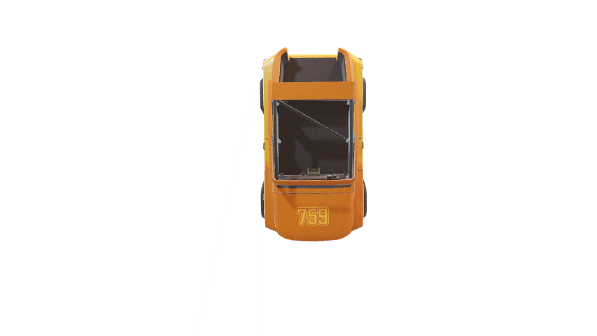
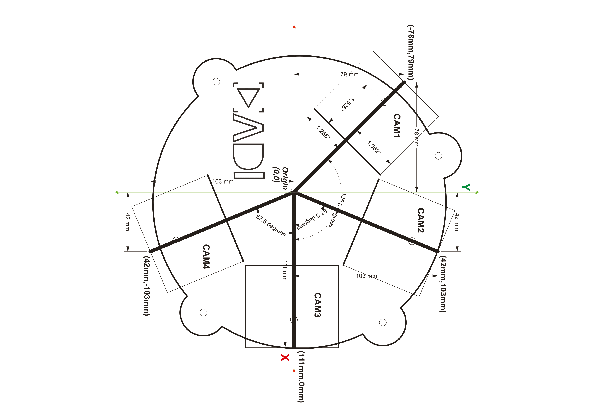
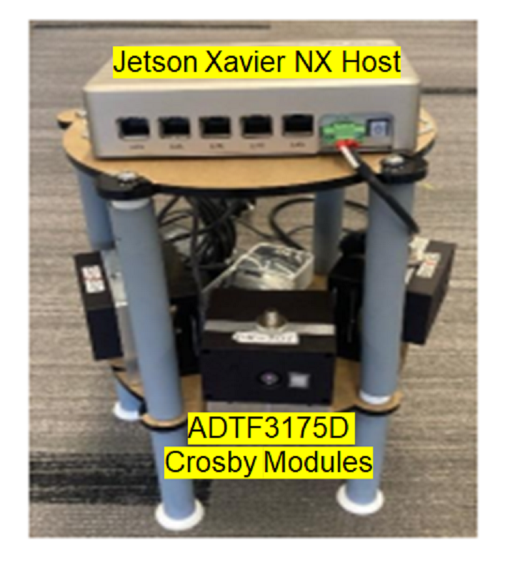
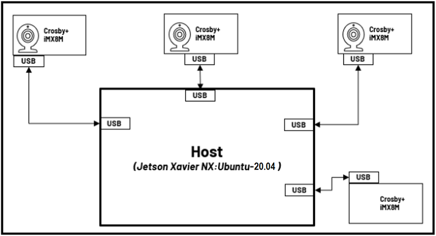

# Creating Safety Bubble Detector with 4 devices:

<span style="color:green">Please go through [Setting up Safety Bubble Detector for a Single sensor](../README.md) to setup single device then we can add multiple devices together.</span>

We can create safety bubble around the robot with multiple cameras. All the sensors are positioned with respect to ``map`` which is assumed to be the center of the circular plate in the below gif.



Below image has the information about camera positions and measurements of the base plate.



The image below shows the actual setup used (for reference):



## Physical setup 

The Roll, Pitch, Yaw, and Translation values are given in the launch files below. Please arrange the modules to match this configuration. The corresponding launch files can be found in the ```launch/``` folder. 
 
|cam_id|launch_file|
-------|-----------|
|cam1|adi_3dtof_safety_bubble_detector_single_cam1_135_deg_yaw_launch.py|
|cam2|adi_3dtof_safety_bubble_detector_single_cam2_67_5_deg_yaw_launch.py|
|cam3|adi_3dtof_safety_bubble_detector_single_cam3_0_deg_yaw_launch.py|
|cam4|adi_3dtof_safety_bubble_detector_single_cam4_minus_67_5_deg_yaw_launch.py|

> [!note]   
>- Make sure the values of ```cam_pos_x```,```cam_pos_y```,```cam_pos_z```,```cam_roll```,```cam_pitch```,```cam_yaw``` are matching with the actual setup.
>- The Translation values are with respect to the center of the base(which is considered as ```map```)  

Now With respect to ```map```(center of circular plate) place the ```cam1``` sensor.

## Connecting 4 Devices to Linux host
It is possible to connect several devices to a Linux Host. Four devices are connected to the host PC in our arrangement.



>[!note]  
If you are using WSL as the Host machine, then you won't be able to list and subscribe to the topics published by the device. Please use a Linux system to help visualize the topics.

To distinguish the devices connected to Linux Host machine we have to assign distinct IP address to them.

For example:
Assume there are four modules present: cam1, cam2, cam3, and cam4. Each of them should have a unique IP address.
|Module name|ip_address|
|-----------|----------|
|    cam1   | 10.41.0.1|
|    cam2   | 10.42.0.1|
|    cam3   | 10.43.0.1|
|    cam4   | 10.44.0.1|


## Steps to change the ip address:  
On the *EVAL-ADTF3175D-NXZ* device:
1. Update the "Address" field in ```/etc/systemd/network/20-wired-usb0.network``` file.
2. Update the server address in ```/etc/ntp.conf``` 
   (```server 10.4x.0.100 iburst```)
   (```pool   10.4x.0.100 iburst```) 
3. Reboot the device and login with the new ip

Follow the instructions in the [Setting up Safety Bubble Detector for a Single sensor](../README.md) file to build ```adi_3dtof_safety_bubble_detector``` node on all the devices.

To run the Safety Bubble Detector on 4 devices follow below steps.  

On ```cam1``` run below command
```bash
$ ros2 launch adi_3dtof_safety_bubble_detector adi_3dtof_safety_bubble_detector_single_cam1_135_deg_yaw_launch.py
```

At this stage, the *adi_3dtof_safety_bubble_detector* will be launched and start publishing the topics from ```cam1```

```
/cam1/object_detected,
/cam1/compressed_out_image, 
/cam1/depth_image, 
/cam1/ab_image 
/cam1/camera_info
```

On ```cam2``` run below command
```bash
$ ros2 launch adi_3dtof_safety_bubble_detector adi_3dtof_safety_bubble_detector_single_cam2_67_5_deg_yaw_launch.py
```  
At this stage, the *adi_3dtof_safety_bubble_detector* will be launched and start publishing the topics from ```cam2```  

```
/cam2/object_detected,
/cam2/compressed_out_image, 
/cam2/depth_image, 
/cam2/ab_image 
/cam2/camera_info
```

On ```cam3``` run below command  
```bash
$ ros2 launch adi_3dtof_safety_bubble_detector adi_3dtof_safety_bubble_detector_single_cam3_0_deg_yaw_launch.py
```  
At this stage, the *adi_3dtof_safety_bubble_detector* will be launched and start publishing the topics from ```cam3```  

```
/cam3/object_detected,
/cam3/compressed_out_image, 
/cam3/depth_image, 
/cam3/ab_image 
/cam3/camera_info
```

On ```cam4``` run below command

```bash
$ ros2 launch adi_3dtof_safety_bubble_detector adi_3dtof_safety_bubble_detector_single_cam4_minus_67_5_deg_yaw_launch.py
```
At this stage, the *adi_3dtof_safety_bubble_detector* will be launched and start publishing the topics from ```cam4```

```
/cam4/object_detected,
/cam4/compressed_out_image, 
/cam4/depth_image, 
/cam4/ab_image 
/cam4/camera_info
```       

By now all the devices are running Safety Bubble Detector algorithm individually, Now we can stitch the ouputs of individual modules on host.

# adi_3dtof_safety_bubble_detector_stitch_host_node

The **adi_3dtof_safety_bubble_detector_stitch_host_node** subscribes to bird's-eye view out_image from all cameras and merges them into a single bird's-eye view output.

## Building the package on host
1. Clone the repo and checkout the correct release branch or tag into ros2 workspace directory

    ```bash
    $ cd ~/ros2_ws/src
    $ git clone https://github.com/analogdevicesinc/adi_3dtof_safety_bubble_detector.git -b v2.1.0
    ```

2. Install dependencies:

    ```bash
    $ cd ~/ros2_ws/
    $ rosdep install --from-paths src -y --ignore-src    
    ```

3. Build the package

    ```bash
    $ cd ~/ros2_ws/
    $ colcon build --symlink-install --cmake-args -DCMAKE_BUILD_TYPE=Release -DBUILD_SBD_STITCH_HOST_NODE=TRUE
    $ source install/setup.bash
    ```

4. Run adi_3dtof_safety_bubble_detector_stitch_host_node

   ```bash
   $ ros2 launch adi_3dtof_safety_bubble_detector adi_3dtof_safety_bubble_detector_four_camera_host_launch.py
   ```

## Published topics

| Topic Name                               |   Description                                                                                 |
|------------------------------------------|-----------------------------------------------------------------------------------------------|
| **/combo_safety_bubble_out_image**       | 8-bit output image                                                                            |
| **/combo_safety_bubble_object_detected** | Boolean topic indicates object detection                                                      |  

## Subscribed topics

| Topic Name                   | Description                                                                     |
|------------------------------|---------------------------------------------------------------------------------|
| **/object_detected**         | Boolean topic indicates object detection                                        |
| **/out_image/compressed**    | Subscribes to compressed output image from `adi_3dtof_safety_bubble_detector` node |
| **/out_image**               | Subscribes to output image from `adi_3dtof_safety_bubble_detector` node         |

## Parameters
  
| parameter                  | Type                     | Default           | Description                                                |  
|----------------------------|--------------------------|-------------------|------------------------------------------------------------|
|**param_camera_prefixes**   | String array             | None              | In multi camera setup, camera prefix names of those cameras ex: [cam1, cam2, cam3] |


>[!note]
>- Make sure that the ADI 3DToF Safety Bubble Detector node is already running on all the devices before running this node.
>- <span style="color:red">**Make sure that the Date/Time is correctly set for all the devices, this application makes use of the topic Timestamp for synchronization. Hence, if the time is not set properly the application will not run.**</span> 
>
>- Ensure rmw settings are updated in all the Devices and the Host to support muti-sensor usecases
>>```bash
>> #Update the default rmw xml profile file to the settings file present inside "rmw_config" foler
>> $ export FASTRTPS_DEFAULT_PROFILES_FILE= ~/ros2_ws/src/adi_3dtof_safety_bubble_detector/rmw_config/rmw_settings.xml
>>#Next restart ROS daemon for the profile changes to take effect
>>$ ros2 daemon stop
>>```
> - The above mentioned steps for rmw settings setup can also be completed by running the "setup_rmw_settings.sh" script present inside the "rmw_config" folder.
>>```bash
>>$ cd ~/ros2_ws/src/adi_3dtof_safety_bubble_detector/rmw_config
>>$ chmod +x setup_rmw_settings.sh
>>$ source setup_rmw_settings.sh
>>```

<br>  
<br>
